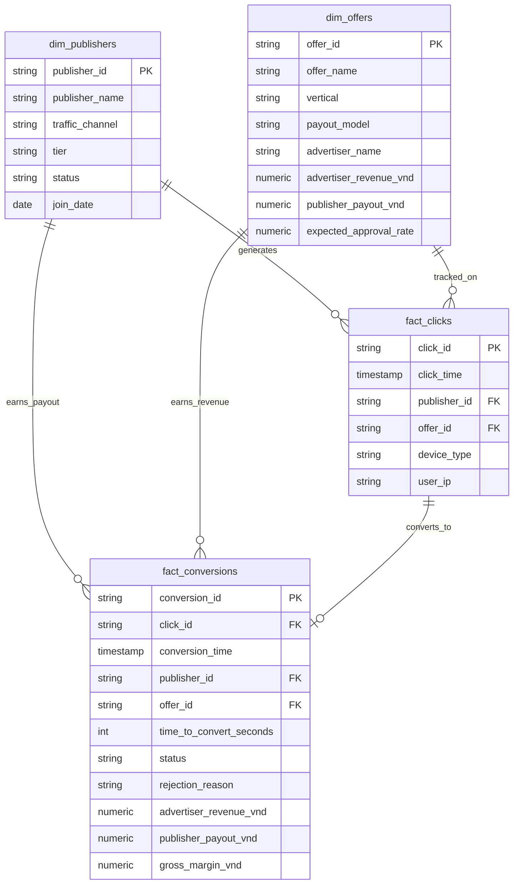

# Affiliate Performance & Traffic Risk Intelligence System (AP-TRIS)

[](#)
[](#)
[](#)

> ⚠️ **Lưu ý về dữ liệu:** Toàn bộ dữ liệu trong dự án là **dữ liệu giả lập** do script `01_data/generate_1m_data.py` sinh ra (seed cố định = 42, có thể tái lập). Tên ngân hàng và nhãn hàng chỉ dùng để mô phỏng bối cảnh. Giá trị hoa hồng và tỷ lệ duyệt là giả định, không phải số liệu thật của bất kỳ đối tác nào.

---

## 1. Bối cảnh bài toán

Một mạng affiliate (tiếp thị liên kết) đứng giữa hai bên:

- **Publisher** (KOC TikTok, media buyer, SEO, cộng đồng Zalo/Telegram...) muốn tối đa hóa click và hoa hồng.
- **Advertiser** (ngân hàng, công ty tài chính, nhãn hàng) chỉ trả tiền cho đơn hoặc hồ sơ **được duyệt**.

Có 3 vấn đề cần giải quyết:

1. **Đo hiệu quả:** CR, Approval Rate, EPC và biên lợi nhuận gộp theo từng offer, publisher và kênh.
2. **Gian lận traffic:** bot tự động điền form và dùng cụm IP sinh lead ảo, khiến sàn trả nhầm hoa hồng.
3. **Giám sát định kỳ:** kiểm tra chất lượng dữ liệu và tự động cảnh báo publisher bất thường.

### Quy mô dữ liệu mô phỏng

| Thành phần | Số lượng |
|---|---|
| Click | 1.000.000 |
| Chuyển đổi (lead/đơn) | 49.006 |
| Publisher | 250 (6 kênh traffic, 4 hạng: Bronze / Silver / Gold / Platinum) |
| Offer | 25 (Ngân hàng – Tài chính, Làm đẹp, Sức khỏe, TMĐT, App, Giáo dục) |
| Thời gian | 2 tháng (08–09/2026) |
| Publisher gian lận được cài sẵn | 5 (dùng để kiểm chứng các rule phát hiện) |

---

## 2. Cấu trúc dữ liệu (Bronze → Silver → Gold)

Dữ liệu được tổ chức theo 3 tầng. File lưu dạng **CSV nén gzip**. Khi máy có `pyarrow`, script tự động ghi ra Parquet thay cho CSV.

```text
01_data/
├── lakehouse/
│   ├── bronze/   fact_clicks.csv.gz (1.000.000 dòng), fact_conversions.csv.gz (49.006 dòng)
│   ├── silver/   dim_publishers, dim_offers, fact_conversions_cleansed (đã ghép thông tin offer)
│   └── gold/     daily_campaign_kpi (KPI theo ngày × offer), publisher_risk_scoring (điểm rủi ro publisher)
└── exports/      accounting_monthly_payout.csv     – bảng hoa hồng & khấu trừ thuế TNCN 10% cho kế toán
                  advertiser_reconciliation_sample.csv – mẫu file đối soát gửi đối tác ngân hàng
```

Bảng click giải nén ra khoảng 74,6 MB. Bản nén gzip chỉ còn 16,6 MB (giảm ~78%), đủ nhẹ để đưa lên GitHub và nạp vào Power BI.

---

## 3. Mô hình dữ liệu (Star Schema)



---

## 4. Bộ KPI

| Chỉ số | Công thức | Ý nghĩa |
| :--- | :--- | :--- |
| **CR %** | Conversions / Clicks | Hiệu quả chuyển click thành đơn |
| **Approval Rate %** | Approved / Conversions | Tỷ lệ hồ sơ được advertiser duyệt |
| **Gross Margin** | Advertiser Revenue − Publisher Payout | Phần sàn giữ lại |
| **Margin %** | Gross Margin / Revenue | Tỷ suất lợi nhuận gộp |
| **EPC** | Publisher Payout / Clicks | Hoa hồng trung bình mỗi click (publisher so với chi phí CPC của mình) |

### Kết quả tổng quan (tính từ dữ liệu mô phỏng)

| KPI | Giá trị |
|---|---|
| CR | 4,90% |
| Approval Rate | 61,8% (69,7% nếu loại 5 publisher gian lận) |
| Doanh thu gộp | 5,89 tỷ VNĐ |
| Hoa hồng publisher | 4,22 tỷ VNĐ |
| Lợi nhuận gộp | 1,67 tỷ VNĐ (margin 28,4%) |
| EPC | ~4.219 VNĐ/click |

---

## 5. SQL (`02_sql/`)

Các script viết theo cú pháp **PostgreSQL**. Riêng `04_cohort_analysis.sql` dùng `DATE_TRUNC` và `TO_CHAR`.

| File | Nội dung |
|---|---|
| `01_schema_setup.sql` | DDL star schema và index |
| `02_kpi_metrics.sql` | Báo cáo theo offer, xếp hạng publisher (`DENSE_RANK`, `SUM() OVER ()`), so sánh kênh traffic |
| `03_fraud_detection.sql` | 3 rule phát hiện gian lận (xem mục 6) |
| `04_cohort_analysis.sql` | Khung phân tích cohort publisher. Dữ liệu hiện chỉ có 2 tháng nên kết quả mang tính minh họa |

Ví dụ: xếp hạng publisher theo lợi nhuận mang về cho sàn.

```sql
SELECT
    p.publisher_id,
    p.traffic_channel,
    COUNT(conv.conversion_id) AS total_conversions,
    SUM(conv.gross_margin_vnd) AS platform_profit_vnd,
    DENSE_RANK() OVER (ORDER BY SUM(conv.gross_margin_vnd) DESC) AS profit_rank,
    ROUND(SUM(conv.gross_margin_vnd) * 100.0
          / NULLIF(SUM(SUM(conv.gross_margin_vnd)) OVER (), 0), 2) AS profit_contribution_pct
FROM dim_publishers p
JOIN fact_conversions conv ON p.publisher_id = conv.publisher_id
GROUP BY p.publisher_id, p.traffic_channel
ORDER BY profit_rank
LIMIT 20;
```

---

## 6. Phát hiện gian lận traffic

| Rule | Ngưỡng | Kết quả trên dữ liệu |
|---|---|---|
| Time-to-convert bất thường | Điền form < 5 giây (người dùng thật có trung vị ~22 phút) | 5.935 lead, toàn bộ trong khoảng 1–3 giây |
| Cụm IP | ≥ 3 đơn từ cùng 1 IP trong 1 ngày | Traffic gian lận dồn về 6 IP thuộc dải `113.161.44.x` |
| Tỷ lệ duyệt thấp | ≥ 20 đơn và Approval Rate < 15% | 5 publisher có tỷ lệ duyệt ~4–6%, trong khi trung bình sàn là 61,8% |

Cả 3 rule cùng chỉ ra **5 publisher**: `PUB_042`, `PUB_077`, `PUB_091`, `PUB_142`, `PUB_188`. Nhóm này chiếm ~12% click và 12% đơn. Có **269 đơn** của nhóm vẫn lọt qua khâu duyệt, tương ứng **41,8 triệu VNĐ** hoa hồng trả sai. File kế toán `accounting_monthly_payout.csv` tự động chuyển 5 publisher này sang trạng thái `HOLD (FRAUD AUDIT)`.

---

## 7. A/B test chính sách hoa hồng (`03_analysis/ab_testing_payout.py`)

> Đây là **case mô phỏng độc lập**. Số liệu được nhập trực tiếp trong script, không lấy từ dataset 1 triệu dòng.

- **Nhóm A (đối chứng):** hoa hồng cố định 250.000 VNĐ/thẻ được duyệt.
- **Nhóm B (thử nghiệm):** hoa hồng bậc thang, 220.000 VNĐ cơ bản cộng thưởng khi vượt mốc (bình quân +45.000 VNĐ/thẻ).

| | Nhóm A | Nhóm B |
|---|---|---|
| Click | 5.200 | 5.250 |
| Thẻ được duyệt | 158 (3,04% trên click) | 208 (3,96% trên click) |

Kiểm định hai tỷ lệ (two-proportion z-test): **Z = 2,57, p ≈ 0,010**, mức tăng tương đối **+30,4%**, khoảng tin cậy 95% của chênh lệch là [+0,22; +1,63] điểm %. Lợi nhuận gộp của sàn tăng **+11,9%** sau khi đã trừ tiền thưởng.

**Hạn chế:** chính sách hoa hồng áp dụng theo publisher, nhưng thử nghiệm lại chia nhóm theo click. Khi triển khai thật cần chia nhóm theo publisher. Vì số publisher ít hơn nhiều so với số click, thử nghiệm sẽ phải chạy lâu hơn để đủ độ tin cậy.

---

## 8. Dashboard Power BI (`04_powerbi/`)

File `dashboard_main.pbip` gồm 3 trang:

1. **Executive Overview:** doanh thu, lợi nhuận gộp, tỷ lệ duyệt, EPC; cơ cấu doanh thu theo ngành hàng; top offer.
2. **Campaign & Traffic:** biểu đồ phân tán Clicks × Approval Rate theo offer, so sánh kênh traffic, bảng chi tiết offer.
3. **Risk Intelligence:** số lead nghi bot, bảng xếp hạng rủi ro publisher.

Công thức DAX được ghi tại [`04_powerbi/dax_measures.md`](04_powerbi/dax_measures.md).

> Khi mở trên máy khác, cần sửa đường dẫn file nguồn trong Power Query (Transform Data → Data source settings) để trỏ tới thư mục `01_data/lakehouse/` trên máy đó.

---

## 9. Pipeline & kiểm tra chất lượng dữ liệu (`05_pipeline_automation/`)

`daily_etl_and_alert.py` chạy 4 bước:

1. **Ingestion:** đọc dữ liệu từ tầng Bronze và Silver.
2. **Data Quality:** kiểm tra khóa chính bị thiếu, đơn đã duyệt mà margin âm, time-to-convert âm.
3. **Transformation:** tổng hợp KPI theo ngày × offer và ghi vào tầng Gold.
4. **Risk alert:** in cảnh báo cho publisher có từ 5 lead nghi bot trở lên, hoặc có tỷ lệ duyệt < 15%.

---

## 10. Insight chính

1. **Ngân hàng – Tài chính (BFSI) là mảng đóng góp lớn nhất:** 40% click nhưng mang lại 44% doanh thu và 42,5% lợi nhuận gộp, nhờ mức hoa hồng CPA/CPL cao (110.000–480.000 VNĐ/đơn). → Nên ưu tiên nguồn lực account management cho các đối tác ngân hàng.
2. **Gian lận gây thất thoát có thể đo được:** 5 publisher, 41,8 triệu VNĐ trả sai. → Nên tự động tạm giữ hoa hồng (hold payout) với đơn có time-to-convert < 5 giây, và audit publisher có tỷ lệ duyệt < 15%.
3. **Phải loại nhiễu gian lận trước khi so sánh kênh:** nhìn số thô, kênh TikTok có tỷ lệ duyệt thấp nhất (60%). Nguyên nhân là một publisher gian lận thuộc kênh này kéo trung bình xuống. Sau khi loại nhóm gian lận, các kênh đều đạt khoảng 69–71%.

---

## 11. Cách chạy lại dự án

```bash
pip install -r requirements.txt

# 1. Sinh dữ liệu mô phỏng 1 triệu click (ghi vào 01_data/raw/)
python 01_data/generate_1m_data.py

# 2. Dựng các tầng Bronze / Silver / Gold và file export
python 01_data/build_lakehouse.py

# 3. Chạy pipeline kiểm tra chất lượng dữ liệu và cảnh báo rủi ro
python 05_pipeline_automation/daily_etl_and_alert.py

# 4. (Tuỳ chọn) A/B test mô phỏng
python 03_analysis/ab_testing_payout.py

# 5. (Tuỳ chọn) Tạo database SQLite/DuckDB để chạy các file SQL
python 01_data/build_database.py
```

## 12. Hạn chế & hướng phát triển

- **Dữ liệu:** dữ liệu là giả lập và chỉ có 2 tháng, nên phân tích cohort/retention chưa có ý nghĩa thống kê.
- **Múi giờ:** timestamp đang lệch 7 giờ do quy đổi UTC (dữ liệu bắt đầu lúc 31/07 17:00 thay vì 01/08 00:00).
- **Định nghĩa rủi ro:** Python, SQL và DAX đang dùng ngưỡng khác nhau. Hướng tiếp theo là gộp thành một risk score có trọng số.
- **Pipeline:** hiện xử lý lại toàn bộ dữ liệu mỗi lần chạy. Hướng tiếp theo là chạy theo lịch, chỉ xử lý phần dữ liệu mới (incremental), và gửi cảnh báo qua email/Slack.
