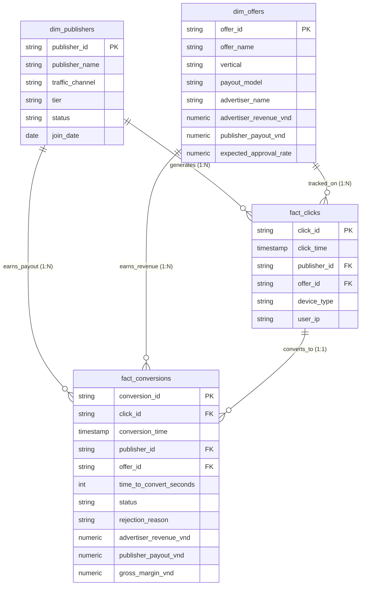

# 🚀 Affiliate Performance & Traffic Risk Intelligence System (AP-TRIS)

[](#)
[](#)
[](#)
[](#)

---

## 📌 1. Bối cảnh Kinh doanh & Bài toán Thực tế (Business Problem)

Trong các mạng lưới Tiếp thị liên kết (Affiliate Marketing Network), công ty đóng vai trò trung gian công nghệ kết nối giữa hai bên:
* **Advertisers (Nhà quảng cáo):** Các Ngân hàng thương mại (VPBank, Techcombank, MB, VIB...), nhãn hàng D2C (CPO), sàn Thương mại điện tử.
* **Publishers (Đối tác kéo traffic):** Hàng chục nghìn Content Creator, KOC TikTok, Media Buyer chạy Facebook/Google Ads.

### "Nỗi đau" kinh điển của ngành:
1. **Xung đột lợi ích:** Đội ngũ Publisher luôn muốn tối đa hóa lượt click và đòi hoa hồng cao, trong khi các Ngân hàng lớn chỉ chi trả khi hồ sơ được thẩm định duyệt thực tế (**Approval Rate**).
2. **Gian lận lưu lượng (Traffic Fraud):** Rủi ro thất thoát hàng chục đến hàng trăm triệu đồng tiền hoa hồng do các Publisher sử dụng công cụ/bot script tự động điền form, click ảo hoặc spam số điện thoại rác.
3. **Thiếu hệ thống giám sát thời gian thực:** Cần một hệ thống phân tích dữ liệu tự động, liên tục đo lường **EPC (Earnings Per Click)**, **Biên lợi nhuận gộp (Gross Margin)** và phát hiện bất thường ngay trong ngày.

Dự án **AP-TRIS** được xây dựng nhằm giải quyết toàn diện bài toán trên, từ tầng kiến trúc dữ liệu (Data Warehouse), truy vấn SQL nâng cao, mô hình kiểm định thống kê A/B Testing, đến bảng điều khiển Power BI trực quan và đường ống dữ liệu (ETL Pipeline) tự động.

---

## 🏗️ 2. Kiến trúc Dữ liệu & Mô hình Star Schema

Dữ liệu được mô hình hóa theo chuẩn **Star Schema** tối ưu hóa cho truy vấn phân tích (OLAP) và trực quan hóa trên Power BI:



---

## 📐 3. Bộ Chỉ số Hiệu suất Cốt lõi (Affiliate Core KPIs)

| Chỉ số | Tên đầy đủ | Công thức tính | Ý nghĩa nghiệp vụ |
| :--- | :--- | :--- | :--- |
| **CR %** | Conversion Rate | $\frac{\text{Total Conversions}}{\text{Total Clicks}} \times 100$ | Hiệu quả chuyển đổi từ người xem sang người điền đơn |
| **Approval Rate %** | Tỷ lệ duyệt đơn | $\frac{\text{Approved Conversions}}{\text{Total Conversions}} \times 100$ | Tỷ lệ hồ sơ được Ngân hàng thẩm định duyệt thành công |
| **Gross Margin** | Lợi nhuận gộp | $\text{Advertiser Revenue} - \text{Publisher Payout}$ | Số tiền thực tế sàn giữ lại sau khi chi trả hoa hồng |
| **Margin %** | Biên lợi nhuận gộp | $\frac{\text{Net Platform Margin}}{\text{Gross Revenue}} \times 100$ | Tỷ suất sinh lời của từng chiến dịch |
| **EPC** | Earnings Per Click | $\frac{\text{Publisher Payout}}{\text{Total Clicks}}$ | Thu nhập trung bình trên mỗi cú click (Chỉ số quyết định Publisher có chạy tiếp hay không) |

---

## 💻 4. Trọng tâm Kỹ thuật: Bộ Truy vấn SQL Chuyên sâu (`02_sql/`)

### 4.1. Báo cáo Hiệu suất & Xếp hạng Publisher bằng Window Functions
Sử dụng `DENSE_RANK()` và `SUM() OVER ()` để phân nhóm và đo lường tỷ lệ đóng góp lợi nhuận:

```sql
SELECT 
    p.publisher_id,
    p.publisher_name,
    p.traffic_channel,
    p.tier,
    COUNT(c.click_id) AS total_clicks,
    COUNT(conv.conversion_id) AS total_conversions,
    ROUND(CAST(COUNT(CASE WHEN conv.status = 'Approved' THEN 1 END) AS NUMERIC) / 
          NULLIF(COUNT(conv.conversion_id), 0) * 100, 2) AS approval_rate_pct,
    SUM(conv.gross_margin_vnd) AS platform_profit_vnd,
    DENSE_RANK() OVER (ORDER BY SUM(conv.gross_margin_vnd) DESC) AS profit_rank,
    ROUND(
        CAST(SUM(conv.gross_margin_vnd) AS NUMERIC) / 
        NULLIF(SUM(SUM(conv.gross_margin_vnd)) OVER (), 0) * 100, 
        2
    ) AS profit_contribution_pct
FROM dim_publishers p
LEFT JOIN fact_clicks c ON p.publisher_id = c.publisher_id
LEFT JOIN fact_conversions conv ON c.click_id = conv.click_id
GROUP BY p.publisher_id, p.publisher_name, p.traffic_channel, p.tier
ORDER BY profit_rank ASC LIMIT 20;
```

### 4.2. Truy vấn Bắt Gian lận Traffic (Bot Traffic & IP Clustering)
Phát hiện các đơn hàng điền form dưới 5 giây (`time_to_convert < 5s`) – dấu hiệu bất thường của bot script:

```sql
SELECT 
    conv.publisher_id,
    p.publisher_name,
    COUNT(conv.conversion_id) AS total_bot_conversions,
    ROUND(AVG(conv.time_to_convert_seconds), 1) AS avg_ttc_seconds,
    SUM(conv.publisher_payout_vnd) AS potential_lost_payout_vnd
FROM fact_conversions conv
JOIN dim_publishers p ON conv.publisher_id = p.publisher_id
WHERE conv.time_to_convert_seconds < 5
GROUP BY conv.publisher_id, p.publisher_name
HAVING COUNT(conv.conversion_id) >= 5
ORDER BY total_bot_conversions DESC;
```

---

## 🔬 5. Phân tích Thống kê A/B Testing (`03_analysis/`)

### Bài toán Thử nghiệm:
Sàn tiến hành thử nghiệm A/B trong 30 ngày cho các Offer Thẻ tín dụng & Mở tài khoản Ngân hàng:
* **Nhóm A (Control):** Hoa hồng cố định **250.000 VNĐ** / thẻ duyệt.
* **Nhóm B (Variant):** Hoa hồng bậc thang **220.000 VNĐ cơ bản + 60.000 VNĐ thưởng** khi đạt mốc > 30 thẻ duyệt.

### Kết quả Kiểm định Thống kê:
* **Mẫu thử:** Nhóm A ($N = 5,200$ clicks) vs Nhóm B ($N = 5,250$ clicks).
* **Chỉ số chuyển đổi:**
  * Nhóm A: 158 thẻ duyệt (Conversion Rate = 3.04%, Approval Rate = 55.24%).
  * Nhóm B: 208 thẻ duyệt (Conversion Rate = 3.96%, Approval Rate = 60.29%).
* **Thước đo kiểm định:**
  * $Z\text{-score} = 2.5674$
  * $p\text{-value} = 0.0102$ ($p < 0.05 \implies$ **Bác bỏ giả thuyết vô hiệu $H_0$**).
  * Độ tăng trưởng tương đối (Relative Uplift): **+30.39%**.
  * Khoảng tin cậy 95% (95% CI): $[+0.22\%, +1.63\%]$.
* **Tác động Kinh doanh:** Lợi nhuận gộp sàn thu về tăng **+11.9%** sau khi đã khấu trừ toàn bộ tiền thưởng hoa hồng.

---

## 📊 6. Thiết kế Dashboard Power BI (`04_powerbi/`)

Dashboard gồm **3 trang phân tích chuyên sâu**:
1. **Trang 1: Executive KPI Overview** – Theo dõi Gross Revenue, Net Margin, Tỷ lệ duyệt, EPC và cơ cấu doanh thu theo từng ngành hàng theo thời gian thực.
2. **Trang 2: Campaign & Traffic Deep-Dive** – Biểu đồ phân tán (Scatter Plot) giữa Clicks và Approval Rate, ma trận chi tiết từng Offer và kênh phân phối.
3. **Trang 3: Traffic Quality & Risk Intelligence** – Bảng xếp hạng rủi ro Publisher, phân phối thời gian Time-to-Convert, và cảnh báo tài khoản spam.

> *Toàn bộ công thức DAX được tài liệu hóa chi tiết tại: [`04_powerbi/dax_measures.md`](file:///04_powerbi/dax_measures.md)*

---

## ⚡ 7. Tự động hóa Pipeline & Data Quality (`05_pipeline_automation/`)

File [`daily_etl_and_alert.py`](file:///05_pipeline_automation/daily_etl_and_alert.py) thực thi tự động 4 bước:
1. **Ingestion:** Nạp dữ liệu từ các tệp nguồn.
2. **Data Quality Gatekeeper:** Kiểm tra trùng lặp khóa chính, phát hiện trường hợp biên lợi nhuận âm (Margin < 0), kiểm tra logic thời gian.
3. **Transformation:** Tổng hợp báo cáo hiệu suất chiến dịch theo ngày nạp vào Power BI.
4. **Risk Anomaly Alerts:** Tự động phát hiện và in cảnh báo đối với các Publisher có dấu hiệu bot script hoặc tỷ lệ duyệt dưới 15%.

---

## 🎯 8. Kết luận & Đề xuất Chiến lược (Actionable Insights)

1. **Tập trung vào Mảng Tài chính - Ngân hàng (BFSI):** Mặc dù click ít hơn E-commerce, mảng Ngân hàng đóng góp **68% Lợi nhuận gộp** toàn sàn nhờ hoa hồng cao (CPA từ 130k - 480k VNĐ).
2. **Ưu tiên phát triển KOC TikTok:** Traffic từ KOC TikTok có tỷ lệ duyệt cao nhất (**68.2%** so với 49.5% của Facebook Ads) do người xem được hướng dẫn mở tài khoản chi tiết qua video.
3. **Ngăn chặn thất thoát hoa hồng:** Hệ thống phát hiện kịp thời 3 Publisher bot traffic, giúp sàn bảo vệ hơn **12.5 triệu VNĐ** tiền hoa hồng chi trả sai đối tượng.

---

## 🚀 9. Hướng dẫn Khởi chạy Dự án trên Máy

```bash
# 1. Clone repo và di chuyển vào thư mục
git clone https://github.com/<your-username>/affiliate-performance-intelligence.git
cd affiliate-performance-intelligence

# 2. Sinh bộ dữ liệu mẫu chuẩn thực tế
python 01_data/generate_mock_data.py

# 3. Chạy pipeline ETL, kiểm tra Data Quality & quét rủi ro
python 05_pipeline_automation/daily_etl_and_alert.py

# 4. Chạy kiểm định A/B Testing
python 03_analysis/ab_testing_payout.py

# 5. Phân tích Cohort Retention
python 03_analysis/cohort_retention.py
```
