# Affiliate Performance & Traffic Risk Intelligence System (AP-TRIS)

[](#)
[](#)
[](#)

> ⚠️ **Lưu ý về dữ liệu:** Toàn bộ dữ liệu trong dự án là **dữ liệu giả lập** do script `01_data/generate_1m_data.py` sinh ra (seed cố định = 42, có thể tái lập). Tên ngân hàng và nhãn hàng chỉ dùng để mô phỏng bối cảnh. Giá trị hoa hồng và tỷ lệ duyệt là giả định, không phải số liệu thật của bất kỳ đối tác nào.

---

## Câu chuyện dự án (đọc trong 30 giây)

> Tôi đóng vai **Data Analyst đứng giữa team tối ưu chiến dịch và team traffic** của một mạng affiliate (tình huống mô phỏng).
>
> 1. **Xung đột:** team traffic muốn cắt kênh TikTok vì tỷ lệ duyệt thấp, team chiến dịch nhận phàn nàn "lead rác" từ ngân hàng. Hai bên dùng hai bộ số khác nhau.
> 2. **Xây nền:** star schema + SQL + dashboard Power BI → một nguồn số liệu chung cho cả hai team.
> 3. **Điều tra:** tỷ lệ duyệt thấp của TikTok đến từ **1 publisher gian lận**. Mở rộng ra: **5 publisher bot, 41,8 triệu VNĐ** hoa hồng trả sai. Loại nhóm này ra thì các kênh ngang nhau → **không cắt TikTok**, mà tạm giữ hoa hồng đơn đáng ngờ.
> 4. **Chốt tiền cho đúng:** đối soát với advertiser bằng SQL ghép 2 nguồn dữ liệu.
> 5. **Câu hỏi tiếp theo:** A/B test chính sách hoa hồng (volume tăng nhưng lãi chưa chắc) và cohort để chọn kênh tuyển publisher (SEO có LTV gấp ~2,3 lần Facebook).

---

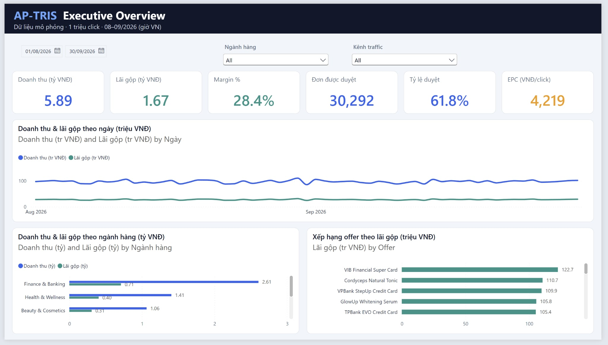

*Trang 1 của dashboard Power BI: KPI tổng quan cho cả hai team (dữ liệu mô phỏng 08–09/2026).*

---

## 1. Bối cảnh: hai team, hai bộ số

Một mạng affiliate đứng giữa hai bên:

- **Publisher** (KOC TikTok, media buyer, SEO, cộng đồng Zalo/Telegram...) muốn nhiều click và hoa hồng cao.
- **Advertiser** (ngân hàng, công ty tài chính, nhãn hàng) chỉ trả tiền cho đơn hoặc hồ sơ **được duyệt**.

Bên trong sàn, hai team nhìn cùng một vấn đề từ hai phía *(tình huống mô phỏng)*:

| Team                                                         | Mối quan tâm                                  | Câu hỏi đặt cho DA                                     |
| ------------------------------------------------------------ | ----------------------------------------------- | ---------------------------------------------------------- |
| **Traffic** (làm việc với publisher)                | Volume, EPC, giữ chân publisher               | "Tỷ lệ duyệt kênh TikTok thấp, có nên cắt không?" |
| **Tối ưu chiến dịch** (làm việc với advertiser) | Tỷ lệ duyệt, chất lượng lead, đối soát | "Ngân hàng phàn nàn lead rác, nguồn từ đâu?"      |

Vai trò của DA: đưa ra **một nguồn số liệu chung**, tìm nguyên nhân gốc và đề xuất hành động cho cả hai team.

### Quy mô dữ liệu mô phỏng

| Thành phần                                 | Số lượng                                                                                                                    |
| -------------------------------------------- | ------------------------------------------------------------------------------------------------------------------------------ |
| Click                                        | 1.000.000                                                                                                                      |
| Chuyển đổi (lead/đơn)                   | 49.006                                                                                                                         |
| Publisher                                    | 250 (6 kênh traffic, 4 hạng: Bronze / Silver / Gold / Platinum)                                                              |
| Offer                                        | 25 (Ngân hàng – Tài chính, Làm đẹp, Sức khỏe, TMĐT, App, Giáo dục)                                                |
| Thời gian                                   | 2 tháng (08–09/2026)                                                                                                         |
| Publisher gian lận được cài sẵn        | 5 (dùng để kiểm chứng các rule phát hiện)                                                                              |
| Lịch sử publisher (cho phân tích cohort) | 1.200 publisher từng đăng ký, 12 tháng (10/2025–09/2026), trong đó 250 publisher managed có dữ liệu click chi tiết |
| File đối soát của advertiser             | 2 tháng, dùng làm nguồn dữ liệu thứ 2 cho bài toán đối soát                                                        |

---

## 2. Xây nền: một nguồn số liệu chung

### 2.1. Mô hình dữ liệu (Star Schema)

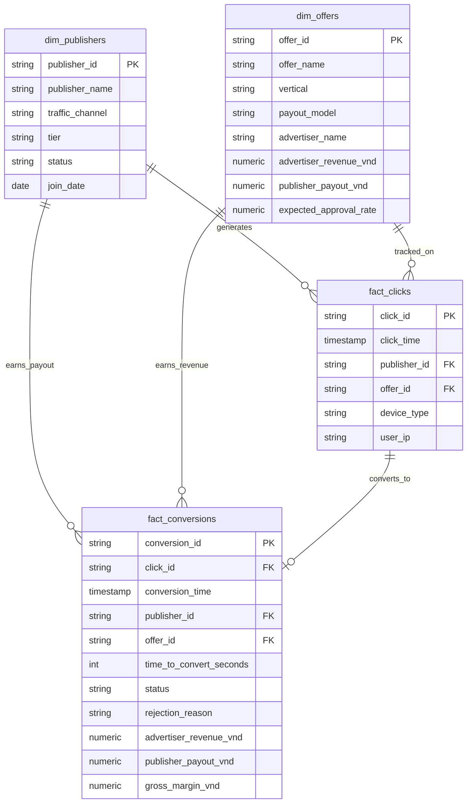

### 2.2. Bộ KPI

| Chỉ số                  | Công thức                            | Ý nghĩa                                                                    |
| :------------------------ | :------------------------------------- | :--------------------------------------------------------------------------- |
| **CR %**            | Conversions / Clicks                   | Hiệu quả chuyển click thành đơn                                        |
| **Approval Rate %** | Approved / Conversions                 | Tỷ lệ hồ sơ được advertiser duyệt                                    |
| **Gross Margin**    | Advertiser Revenue − Publisher Payout | Phần sàn giữ lại                                                         |
| **Margin %**        | Gross Margin / Revenue                 | Tỷ suất lợi nhuận gộp                                                   |
| **EPC**             | Publisher Payout / Clicks              | Hoa hồng trung bình mỗi click (publisher so với chi phí CPC của mình) |

**Kết quả tổng quan (tính từ dữ liệu mô phỏng):**

| KPI                 | Giá trị                                      |
| ------------------- | ---------------------------------------------- |
| CR                  | 4,90%                                          |
| Approval Rate       | 61,8% (69,7% nếu loại 5 publisher gian lận) |
| Doanh thu gộp      | 5,89 tỷ VNĐ                                  |
| Hoa hồng publisher | 4,22 tỷ VNĐ                                  |
| Lợi nhuận gộp    | 1,67 tỷ VNĐ (margin 28,4%)                   |
| EPC                 | ~4.219 VNĐ/click                              |

### 2.3. SQL (`02_sql/`)

Các script viết theo cú pháp **PostgreSQL** và đã được chạy thử trên DuckDB.

| File                                 | Nội dung                                                                                                                                       |
| ------------------------------------ | ----------------------------------------------------------------------------------------------------------------------------------------------- |
| `01_schema_setup.sql`              | DDL star schema và index                                                                                                                       |
| `02_kpi_metrics.sql`               | Báo cáo theo offer, xếp hạng publisher (`DENSE_RANK`, `SUM() OVER ()`), so sánh kênh traffic                                          |
| `03_fraud_detection.sql`           | 3 rule phát hiện gian lận (xem mục 3)                                                                                                       |
| `04_cohort_analysis.sql`           | Cohort publisher: ma trận retention (pivot bằng`FILTER`), LTV cộng dồn theo kênh (`SUM() OVER`)                                        |
| `05_advertiser_reconciliation.sql` | Đối soát tháng:`FULL OUTER JOIN` tracking của sàn với file advertiser, phân loại sai lệch, tính doanh thu được xuất hóa đơn |
| `06_weekly_wow_report.sql`         | Báo cáo tuần: KPI từng offer so với tuần trước bằng`LAG()`, tự gắn cờ offer tụt tỷ lệ duyệt hoặc tụt lãi                   |

Ví dụ: xếp hạng publisher theo lợi nhuận mang về cho sàn.

```sql
SELECT
    p.publisher_id,
    p.traffic_channel,
    COUNT(conv.conversion_id) AS total_conversions,
    SUM(conv.gross_margin_vnd) AS platform_profit_vnd,
    DENSE_RANK() OVER (ORDER BY SUM(conv.gross_margin_vnd) DESC) AS profit_rank,
    ROUND(SUM(conv.gross_margin_vnd) * 100.0
          / NULLIF(SUM(SUM(conv.gross_margin_vnd)) OVER (), 0), 2) AS profit_contribution_pct
FROM dim_publishers p
JOIN fact_conversions conv ON p.publisher_id = conv.publisher_id
GROUP BY p.publisher_id, p.traffic_channel
ORDER BY profit_rank
LIMIT 20;
```

### 2.4. Dashboard Power BI (`04_powerbi/`)

File `dashboard_main.pbip` gồm 3 trang:

| Trang                             | Người xem                     | Nội dung chính                                                                                                                                                             |
| --------------------------------- | ------------------------------- | ---------------------------------------------------------------------------------------------------------------------------------------------------------------------------- |
| **1. Tổng quan**           | Quản lý, cả hai team         | 6 thẻ KPI (doanh thu, lãi gộp, margin %, đơn duyệt, tỷ lệ duyệt, EPC); doanh thu & lãi theo ngày; theo ngành hàng; xếp hạng offer                             |
| **2. Chiến dịch & Kênh** | Team traffic, team chiến dịch | **Tỷ lệ duyệt theo kênh trước & sau khi loại gian lận**; phân tán offer (tỷ lệ duyệt × lãi gộp); bảng chi tiết offer                                 |
| **3. Rủi ro gian lận**    | Team chiến dịch, kế toán    | Thẻ cảnh báo (lead nghi bot, publisher gắn cờ, hoa hồng trả sai); phân phối thời gian click → điền form; lý do từ chối; bảng chấm điểm rủi ro publisher |

**Trang 1 – Tổng quan:** xem ảnh ở đầu README.

**Trang 2 – Chiến dịch & Kênh**

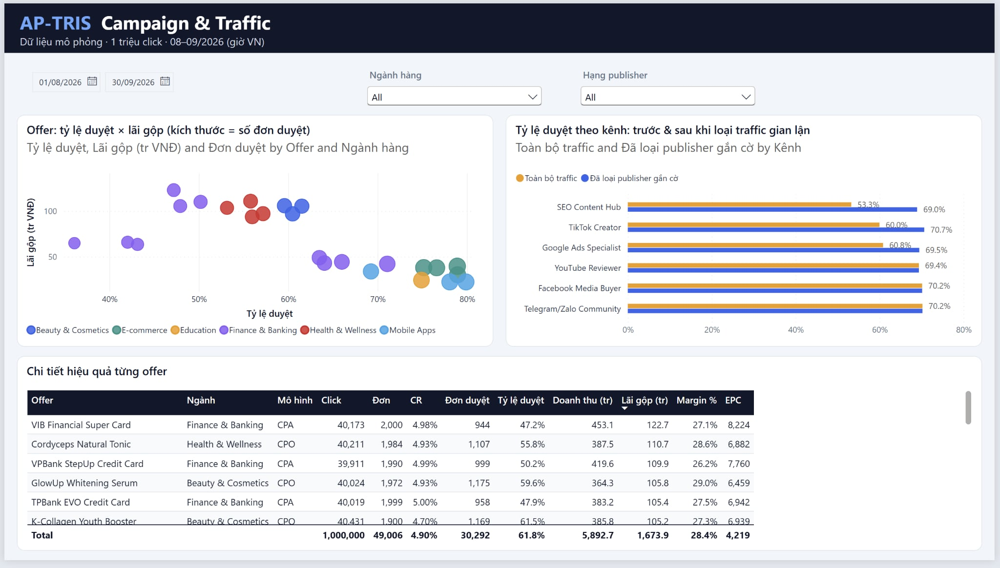

*Điểm cần chú ý: biểu đồ thanh "trước & sau khi loại gian lận" là nơi bắt đầu cuộc điều tra ở mục 3.*

**Trang 3 – Rủi ro gian lận**

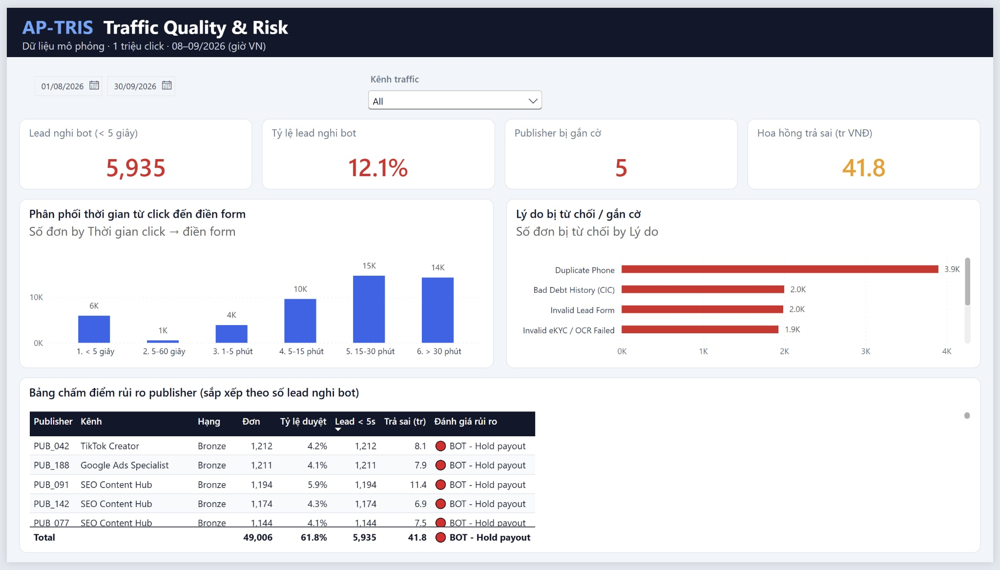

*Điểm cần chú ý: 4 thẻ cảnh báo (5.935 lead nghi bot · 12,1% · 5 publisher · 41,8 triệu VNĐ) và bảng rủi ro với 5 publisher gian lận ở đầu bảng.*

Bố cục chi tiết ở [`04_powerbi/dashboard_wireframe.md`](04_powerbi/dashboard_wireframe.md); toàn bộ 22 measure DAX ở [`04_powerbi/dax_measures.md`](04_powerbi/dax_measures.md).

> Đường dẫn dữ liệu được gom vào một tham số Power Query `DataFolder`. Khi mở trên máy khác, chỉ cần vào **Transform data → Edit parameters**, trỏ `DataFolder` tới thư mục `01_data\lakehouse\` rồi bấm **Refresh**.
>
> Model có bảng `dim_date` và quy đổi timestamp sang giờ Việt Nam (UTC+7).

---

## 3. Điều tra: tỷ lệ duyệt thấp là do kênh hay do gian lận?

**Bước 1 – Dấu hiệu.** Trên dashboard, TikTok Creator có tỷ lệ duyệt 60%, trong khi Facebook và Telegram/Zalo khoảng 70%.

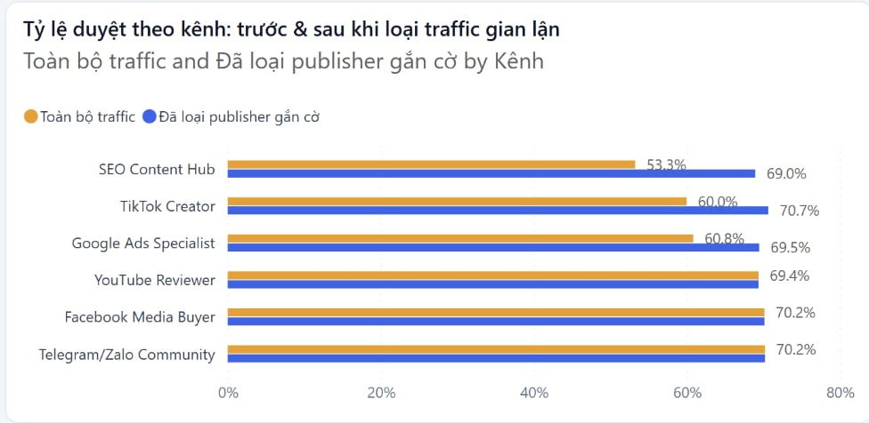

*TikTok và SEO thấp hơn hẳn khi nhìn số thô (cột cam), nhưng ngang các kênh khác sau khi loại publisher gắn cờ (cột xanh).*

**Bước 2 – Đào sâu.** Tách theo publisher thì thấy một publisher trong kênh TikTok (`PUB_042`) có tỷ lệ duyệt chỉ ~4%, và các đơn được điền form trong 1–3 giây.

**Bước 3 – Mở rộng bằng 3 rule** (`02_sql/03_fraud_detection.sql`):

| Rule                          | Ngưỡng                                                            | Kết quả trên dữ liệu                                                   |
| ----------------------------- | ------------------------------------------------------------------- | --------------------------------------------------------------------------- |
| Time-to-convert bất thường | Điền form < 5 giây (người dùng thật có trung vị ~22 phút) | 5.935 lead, toàn bộ trong khoảng 1–3 giây                              |
| Cụm IP                       | ≥ 3 đơn từ cùng 1 IP trong 1 ngày                             | Traffic gian lận dồn về 6 IP thuộc dải`113.161.44.x`                 |
| Tỷ lệ duyệt thấp          | ≥ 20 đơn và Approval Rate < 15%                                 | 5 publisher có tỷ lệ duyệt ~4–6%, trong khi trung bình sàn là 61,8% |

Cả 3 rule cùng chỉ ra **5 publisher**: `PUB_042`, `PUB_077`, `PUB_091`, `PUB_142`, `PUB_188`. Nhóm này chiếm ~12% click và 12% đơn. Có **269 đơn** của nhóm vẫn lọt qua khâu duyệt, tương ứng **41,8 triệu VNĐ** hoa hồng trả sai. File kế toán `accounting_monthly_payout.csv` tự động chuyển 5 publisher này sang trạng thái `HOLD (FRAUD AUDIT)`.

<table>
<tr>
<td width="50%">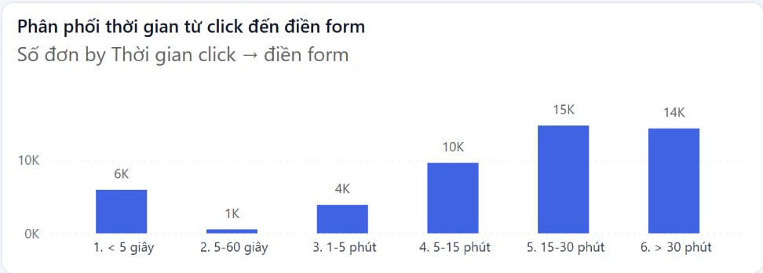</td>
<td width="50%">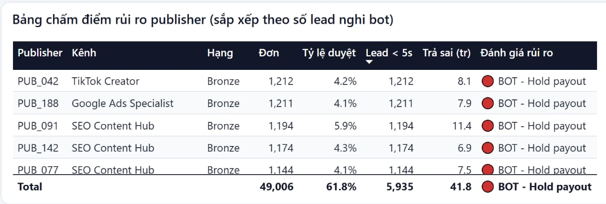</td>
</tr>
<tr>
<td><em>~6.000 đơn điền form dưới 5 giây, trong khi nhóm 5–60 giây gần như trống: người thật không điền nhanh như vậy, đây là dấu hiệu bot.</em></td>
<td><em>5 publisher bị gắn cờ nằm đầu bảng, cùng số lead nghi bot và tiền trả sai.</em></td>
</tr>
</table>

**Bước 4 – Kiểm tra lại kết luận ban đầu.** Loại 5 publisher gian lận ra rồi so sánh lại các kênh:

| Kênh                   | Tỷ lệ duyệt (toàn bộ) | Tỷ lệ duyệt (đã loại gian lận) |
| ----------------------- | -------------------------- | ------------------------------------- |
| TikTok Creator          | 60,0%                      | 70,7%                                 |
| SEO Content Hub         | 53,3%                      | 69,0%                                 |
| Google Ads Specialist   | 60,8%                      | 69,5%                                 |
| Facebook Media Buyer    | 70,2%                      | 70,2%                                 |
| Telegram/Zalo Community | 70,2%                      | 70,2%                                 |
| YouTube Reviewer        | 69,4%                      | 69,4%                                 |

**Kết luận cho hai team:**

- **Team traffic:** không nên cắt TikTok. Vấn đề nằm ở vài publisher cụ thể, không phải ở cả kênh.
- **Team chiến dịch:** nguồn "lead rác" chính là 5 publisher này. Đề xuất tạm giữ hoa hồng (hold payout) tự động cho đơn có time-to-convert < 5 giây, và audit publisher có tỷ lệ duyệt < 15%.

---

## 4. Chốt tiền cho đúng: đối soát với advertiser

Cuối tháng, số đơn được duyệt theo tracking của sàn phải khớp với số liệu advertiser xác nhận, rồi mới xuất hóa đơn và trả hoa hồng.

`02_sql/05_advertiser_reconciliation.sql` thực hiện việc này:

- `FULL OUTER JOIN` hai nguồn dữ liệu: tracking của sàn và file advertiser gửi về (`click_id = sub_id`).
- Phân loại 5 loại sai lệch: thiếu ở advertiser, thiếu trong tracking, lệch trạng thái, lệch tiền, đơn pending đã được chốt.
- Tách riêng khoản "đơn pending được ngân hàng chốt duyệt" để không báo động nhầm.

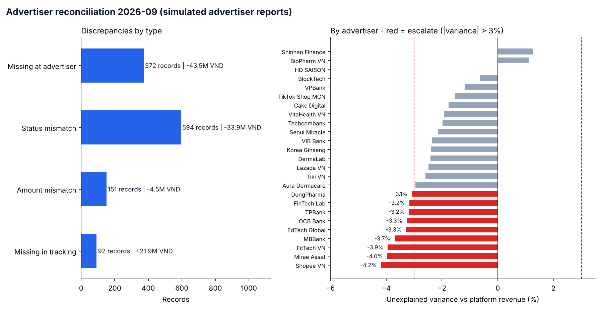

*Trái: số đơn và số tiền lệch theo từng loại sai lệch. Phải: chênh lệch không giải thích được theo advertiser; màu đỏ là advertiser lệch quá 3%, cần escalate. Biểu đồ do `recurring_reports.py` tự sinh cùng file Excel.*

Kết quả tháng 09/2026: chênh lệch không giải thích được **−2,1%**. Kết quả SQL khớp với bản Python (`05_pipeline_automation/recurring_reports.py`). Script Python cũng xuất báo cáo tuần và file đối soát ra Excel.

---

## 5. Câu hỏi tiếp theo từ hai team

### 5.1. Team traffic: "Có nên đổi sang hoa hồng bậc thang để kéo volume?" → A/B test (`03_analysis/ab_testing_payout.py`)

**Câu hỏi kinh doanh:** chuyển offer Ngân hàng – Tài chính từ hoa hồng cố định sang hoa hồng bậc thang (giảm 12% hoa hồng cơ bản, thưởng 60.000 VNĐ/đơn khi publisher vượt 30 đơn duyệt/tháng) thì lãi của sàn có tăng không?

**Thiết kế:** chính sách áp dụng cho từng publisher, nên **đơn vị chia nhóm là publisher**, không phải click.

| Bước            | Dữ liệu                                                          | Kết quả                                                                                                                                                        |
| ----------------- | ------------------------------------------------------------------ | ---------------------------------------------------------------------------------------------------------------------------------------------------------------- |
| 1. Baseline       | Thật (245 publisher, đã loại nhóm gian lận)                  | Trung bình 21,1 đơn duyệt/publisher/tháng, độ lệch chuẩn 38,6 (rất lệch)                                                                              |
| 2. Power analysis | Thật                                                              | Chia ngẫu nhiên đơn giản: chỉ phát hiện được mức tăng ≥ 66%                                                                                        |
| 3. A/A test       | Thật                                                              | Chia theo**cặp publisher tương đồng (matched pairs)**: hai nhóm cân bằng (p = 0,72), MDE giảm mạnh                                               |
| 4. Thử nghiệm   | **Mô phỏng** (giả định nhóm B tăng ~15% sản lượng) | Sản lượng tăng**+14,1%** (p < 0,001); lãi sàn tăng +14,1% nhưng **không có ý nghĩa thống kê** (p = 0,13; khoảng tin cậy 95% chứa 0) |

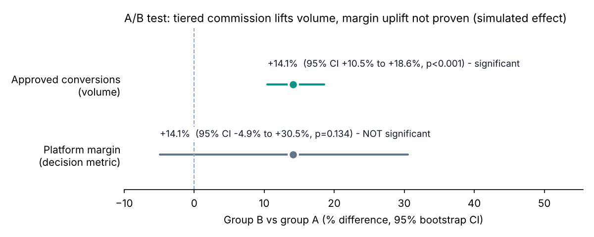

*Volume tăng có ý nghĩa thống kê (khoảng tin cậy nằm hẳn bên phải 0); lãi của sàn thì khoảng tin cậy vẫn cắt qua 0, nên chưa kết luận được.*

**Kết luận:** chính sách làm tăng sản lượng, nhưng chưa đủ bằng chứng là tăng lãi. Chưa nên triển khai toàn bộ. Nên chạy lâu hơn hoặc dùng CUPED (dữ liệu kỳ trước) để giảm nhiễu. Quyết định dựa trên **lãi của sàn**, không dựa trên sản lượng.

### 5.2. Team phát triển publisher: "Nên tuyển publisher từ kênh nào?" → Cohort (`03_analysis/cohort_retention.py`, `02_sql/04_cohort_analysis.sql`)

**Câu hỏi kinh doanh:** publisher đến từ kênh nào thì ở lại lâu và mang về nhiều lãi nhất? Team Publisher Development nên đầu tư vào đâu?

**Định nghĩa:**

- **Cohort:** nhóm publisher theo tháng đăng ký.
- **Active:** có ít nhất 1 đơn được duyệt trong tháng.
- **Logo retention:** % publisher của cohort còn active ở tháng M+k. Mẫu số là toàn bộ cohort, kể cả người chưa từng kích hoạt.
- **Revenue retention:** lãi của cohort ở tháng M+k so với tháng M+1 (tháng đầy đủ đầu tiên).
- **LTV-3:** lãi cộng dồn sau 3 tháng, chia cho **mỗi publisher đăng ký**.

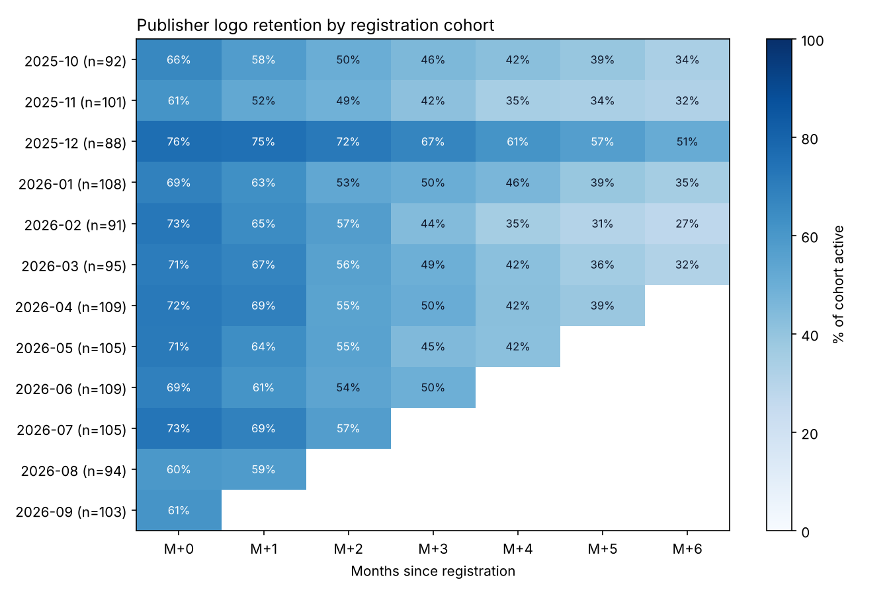

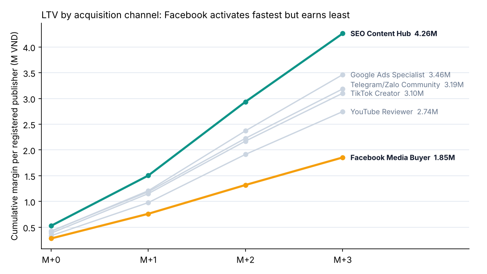

*Lãi cộng dồn trên mỗi publisher đăng ký, từ M+0 đến M+3: SEO dẫn đầu, Facebook Media Buyer thấp nhất dù kích hoạt nhanh nhất.*

| Kênh                   | Kích hoạt | Còn active ở M+3 | LTV-3 / publisher đăng ký |
| ----------------------- | ----------- | ------------------ | ---------------------------- |
| SEO Content Hub         | 71%         | 59%                | 4,26 triệu VNĐ             |
| Google Ads Specialist   | 74%         | 47%                | 3,46 triệu VNĐ             |
| Telegram/Zalo Community | 69%         | 38%                | 3,19 triệu VNĐ             |
| TikTok Creator          | 74%         | 47%                | 3,10 triệu VNĐ             |
| YouTube Reviewer        | 83%         | 60%                | 2,74 triệu VNĐ             |
| Facebook Media Buyer    | 83%         | 42%                | 1,85 triệu VNĐ             |

**Insight:**

1. **Khoảng 24% publisher đăng ký nhưng không bao giờ kích hoạt.** Trong số đã kích hoạt, chỉ khoảng 65% còn hoạt động ở M+3. Có hai đòn bẩy: onboarding trong 30 ngày đầu, và giữ chân sớm.
2. **Facebook Media Buyer kích hoạt nhanh nhất (83%) nhưng LTV thấp nhất.** Nhóm này vào nhanh, đi nhanh: traffic trả phí dừng ngay khi EPC giảm. SEO kích hoạt chậm hơn nhưng bền và có LTV cao nhất.
3. **Revenue retention > 100% sau M+1.** Publisher ở lại thường tăng dần sản lượng, nên một publisher giữ được có giá trị lớn hơn nhiều so với con số tháng đầu.
4. **Cohort 12/2025 có retention vượt trội (51% ở M+6).** Lý do là cohort này có 40% publisher managed, so với khoảng 20% ở các cohort khác. Khác biệt đến từ **cơ cấu cohort**, không phải vì "tháng 12 tốt hơn". Phải tách managed và long-tail trước khi kết luận.

**Lưu ý chất lượng dữ liệu:** có 9 publisher-tháng phát sinh hoạt động trước ngày đăng ký. Script tự báo cáo và loại bỏ các dòng này.

> Lịch sử 12 tháng là dữ liệu mô phỏng (`01_data/generate_publisher_history.py`). Tỷ lệ churn theo kênh là **giả định đầu vào** và được ghi rõ trong script. Mục đích của phần này là thể hiện phương pháp. Hoạt động tháng 8–9 của 250 publisher managed lấy từ dữ liệu chi tiết.

---

## 6. Tổng kết & đề xuất

| # | Phát hiện                                                                          | Đề xuất                                                                            | Team liên quan         |
| - | ------------------------------------------------------------------------------------ | ------------------------------------------------------------------------------------- | ----------------------- |
| 1 | Tỷ lệ duyệt thấp của TikTok là do 1 publisher gian lận, không phải do kênh | Không cắt kênh; đánh giá kênh trên dữ liệu đã loại traffic gắn cờ      | Traffic                 |
| 2 | 5 publisher bot, 41,8 triệu VNĐ trả sai                                           | Tự động hold payout với đơn < 5 giây; audit publisher có tỷ lệ duyệt < 15% | Chiến dịch, Kế toán |
| 3 | Ngân hàng – Tài chính: 40% click nhưng 42,5% lợi nhuận gộp                  | Ưu tiên account management cho đối tác ngân hàng                               | Chiến dịch            |
| 4 | Hoa hồng bậc thang tăng volume nhưng chưa chứng minh được tăng lãi        | Chưa triển khai; chạy test lâu hơn                                               | Traffic                 |
| 5 | Facebook kích hoạt nhanh nhưng LTV thấp nhất; SEO có LTV gấp ~2,3 lần        | Đánh giá kênh tuyển publisher bằng LTV, không bằng số đăng ký             | Phát triển publisher  |

**Bài học chung:** phải loại nhiễu (gian lận, cơ cấu cohort) trước khi kết luận, và ra quyết định dựa trên **lãi của sàn** chứ không dựa trên volume.

---

## Phụ lục A. Cấu trúc dữ liệu

Dữ liệu được tổ chức theo 3 tầng. File lưu dạng **CSV nén gzip**. Khi máy có `pyarrow`, script tự động ghi ra Parquet thay cho CSV.

```text
01_data/
├── lakehouse/
│   ├── bronze/   fact_clicks.csv.gz (1.000.000 dòng), fact_conversions.csv.gz (49.006 dòng)
│   ├── silver/   dim_publishers, dim_offers, fact_conversions_cleansed (đã ghép thông tin offer)
│   └── gold/     daily_campaign_kpi (KPI theo ngày × offer), publisher_risk_scoring (điểm rủi ro publisher)
├── sources/
│   ├── advertiser_reports/   file đối soát hằng tháng do advertiser gửi về (nguồn dữ liệu thứ 2, mô phỏng)
│   ├── publisher_registry.csv.gz           1.200 publisher từng đăng ký (cho cohort)
│   └── publisher_monthly_activity.csv.gz   đơn duyệt & lãi theo publisher × tháng, 12 tháng
└── exports/      accounting_monthly_payout.csv     – bảng hoa hồng & khấu trừ thuế TNCN 10% cho kế toán
                  advertiser_reconciliation_sample.csv – mẫu file đối soát gửi đối tác ngân hàng
                  reports/  báo cáo Excel tự động: weekly_performance_*.xlsx, monthly_reconciliation_*.xlsx
```

Bảng click giải nén ra khoảng 74,6 MB. Bản nén gzip chỉ còn 16,6 MB (giảm ~78%), đủ nhẹ để đưa lên GitHub và nạp vào Power BI.

## Phụ lục B. Pipeline & kiểm tra chất lượng dữ liệu (`05_pipeline_automation/`)

`daily_etl_and_alert.py` chạy 4 bước:

`daily_etl_and_alert.py` chạy 4 bước:

1. **Ingestion:** đọc dữ liệu từ tầng Bronze và Silver.
2. **Data Quality:** kiểm tra khóa chính bị thiếu, đơn đã duyệt mà margin âm, time-to-convert âm.
3. **Transformation:** tổng hợp KPI theo ngày × offer và ghi vào tầng Gold.
4. **Risk alert:** in cảnh báo cho publisher có từ 5 lead nghi bot trở lên, hoặc có tỷ lệ duyệt < 15%.

## Phụ lục C. Cách chạy lại dự án

```bash
pip install -r requirements.txt

# 1. Sinh dữ liệu mô phỏng 1 triệu click (ghi vào 01_data/raw/)
python 01_data/generate_1m_data.py

# 2. Dựng các tầng Bronze / Silver / Gold và file export
python 01_data/build_lakehouse.py

# 3. Chạy pipeline kiểm tra chất lượng dữ liệu và cảnh báo rủi ro
python 05_pipeline_automation/daily_etl_and_alert.py

# 4. Sinh file đối soát của advertiser (nguồn dữ liệu thứ 2) và chạy báo cáo định kỳ ra Excel
python 01_data/generate_advertiser_reports.py
python 05_pipeline_automation/recurring_reports.py              # tuần & tháng gần nhất
python 05_pipeline_automation/recurring_reports.py --month 2026-08

# 5. A/B test: power analysis, A/A test, thử nghiệm mô phỏng
python 03_analysis/ab_testing_payout.py

# 6. Cohort: sinh lịch sử 12 tháng của publisher, rồi phân tích retention & LTV
python 01_data/generate_publisher_history.py
python 03_analysis/cohort_retention.py

# 7. (Tuỳ chọn) Tạo database SQLite/DuckDB để chạy các file SQL
python 01_data/build_database.py
```

## Phụ lục D. Hạn chế & hướng phát triển

- **Dữ liệu:** dữ liệu là giả lập. Kết quả cohort phản ánh các giả định churn đặt trong script sinh dữ liệu; giá trị của phần này nằm ở phương pháp.
- **Múi giờ:** file dữ liệu gốc lưu timestamp theo UTC. Power BI, script đối soát và cohort đã quy đổi sang giờ Việt Nam; các file SQL KPI và gian lận vẫn đang dùng UTC.
- **Định nghĩa rủi ro:** Python, SQL và DAX đang dùng ngưỡng khác nhau. Hướng tiếp theo là gộp thành một risk score có trọng số.
- **File kế toán `accounting_monthly_payout.csv`:** đang cộng dồn cả 2 tháng và tính theo dữ liệu tracking. Bảng chi trả theo từng tháng, dựa trên đơn đã được advertiser xác nhận, nằm trong file đối soát `monthly_reconciliation_<tháng>.xlsx`.
- **Pipeline:** hiện xử lý lại toàn bộ dữ liệu mỗi lần chạy. Hướng tiếp theo là chạy theo lịch, chỉ xử lý phần dữ liệu mới (incremental), và gửi cảnh báo qua email/Slack.
